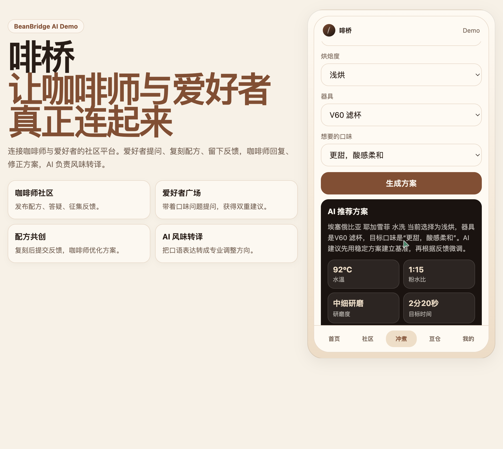
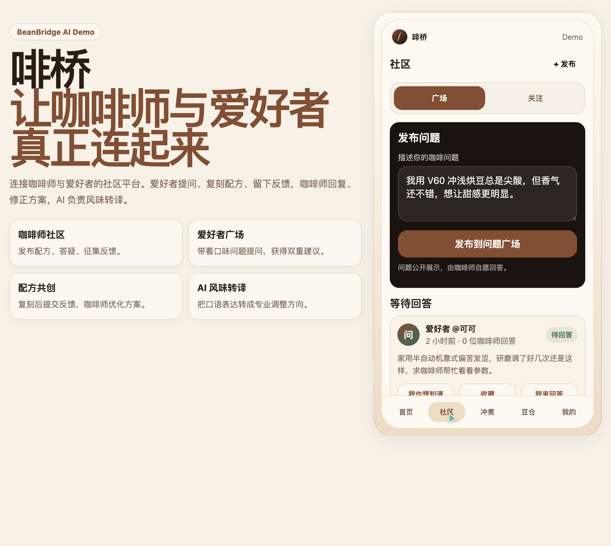
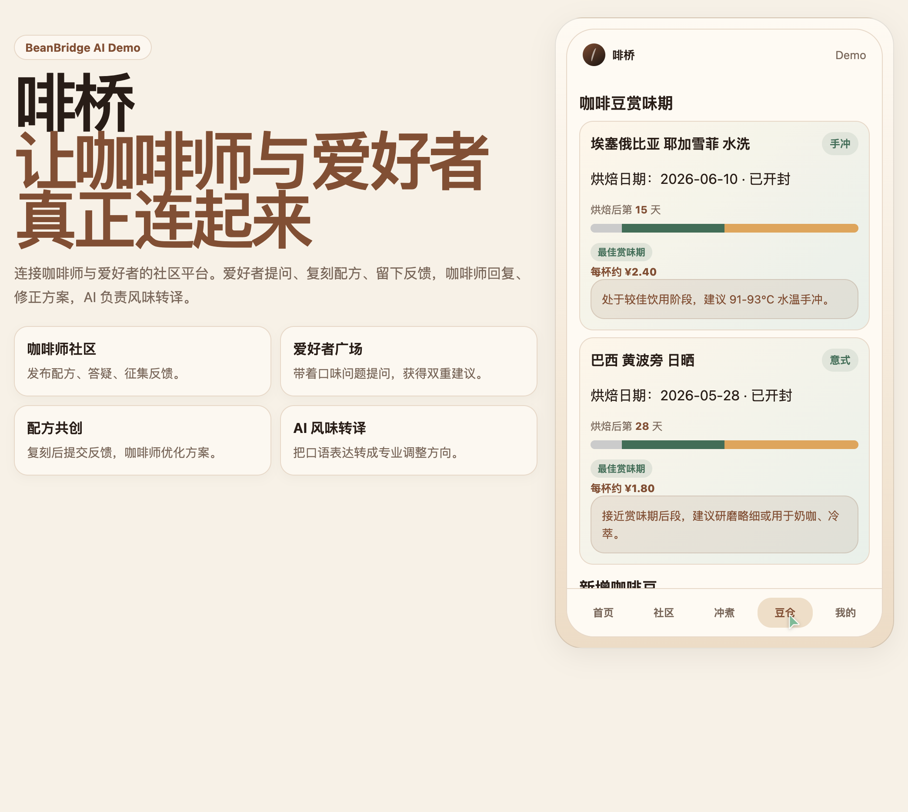
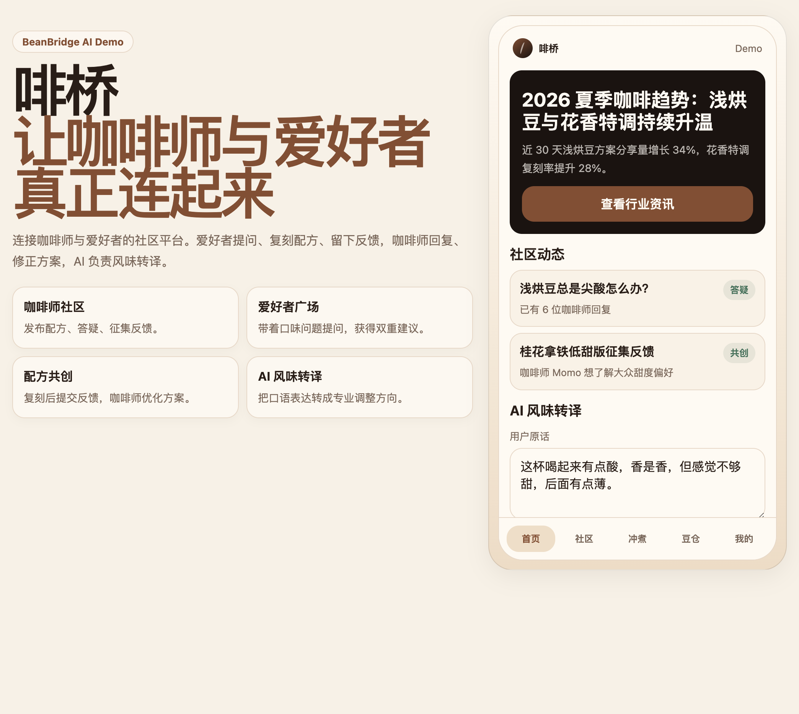
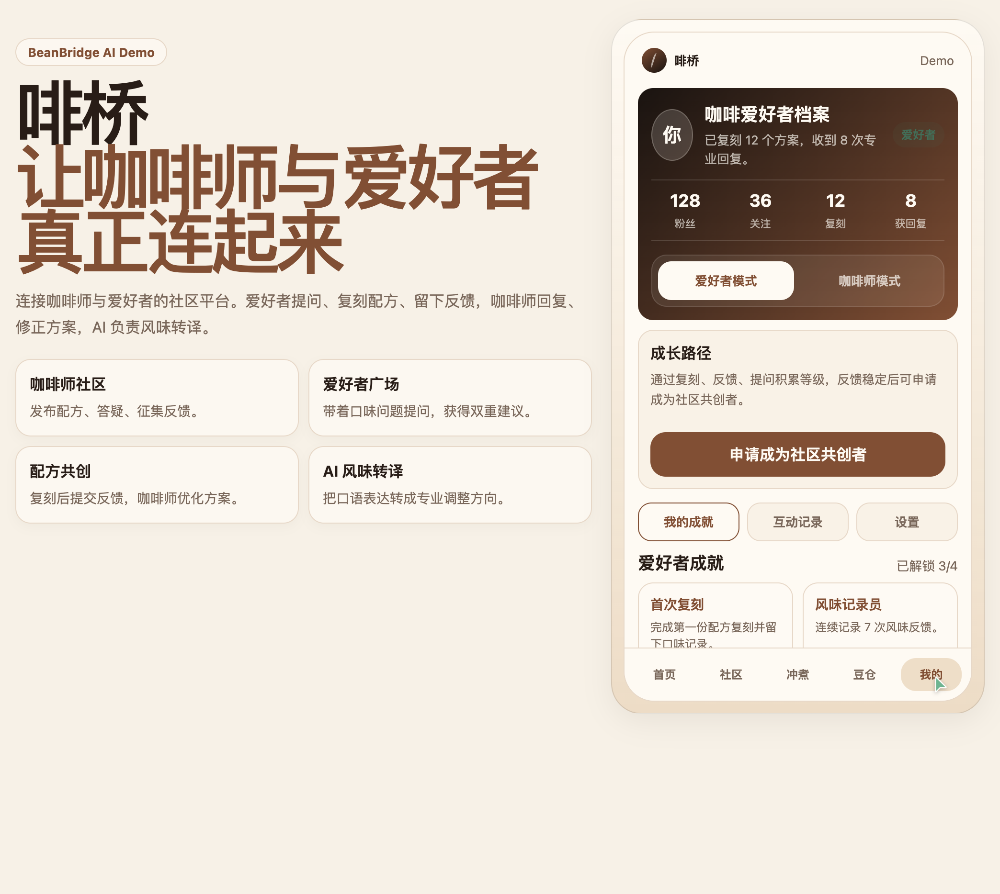

# 【学习工作】啡桥 BeanBridge — 连接咖啡师与爱好者的 AI 社区平台

---

## 一、Demo 简介

### 是什么

**啡桥 BeanBridge** 是一款帮助咖啡师服务客人、沉淀专业资产的社区小程序 Demo。咖啡师可以发布冲煮方案、管理豆仓档案、收集客人复刻后的风味反馈；客人可以跟着方案一步步冲煮、用大白话描述喝到的风味、获得 AI 转译的专业调整建议。AI 作为"翻译官"，把客人的模糊感受翻译成咖啡师能听懂的语言，也把咖啡师的专业方案翻译成客人能跟着做的步骤。

### 面向谁

- **咖啡师（核心用户）**：希望把专业方案传递给客人、收集真实复刻反馈、建立个人配方档案和粉丝社群的从业者
- **咖啡爱好者（服务对象）**：买豆子回家想复刻店里风味的客人，以及想学习冲煮但缺乏系统指导的入门者

### 主要功能

#### 1. AI 冲煮方案 + 风味雷达图 + 冲煮计时器

咖啡师录入豆子信息和冲煮参数，AI 生成可分享的专属冲煮方案。方案附带 **6 维风味雷达图**（酸质/甜感/醇厚度/余韵/苦味/整体风味），咖啡师可设定目标风味轮廓；客人复刻时点击"开始冲煮"进入**分阶段计时模式**（闷蒸→第一段→第二段→第三段），每阶段显示目标注水量和倒计时，把专业方案变成"跟着做"的傻瓜式引导。冲煮完成后客人的风味评分自动汇总到咖啡师后台，支持查看统计趋势。

#### 2. 社区互动（方案流 + 问答广场 + 风味转译）

咖啡师发布可复刻的冲煮方案，客人扫码即可获取完整豆卡和冲煮参数。客人复刻后用大白话描述喝到的风味（"有点酸，香是香，但感觉不够甜"），**AI 自动转译成专业调整建议**（"提高水温 1-2°C，第二段注水放慢"）—— 咖啡师再也不用猜客人到底在说什么。客人的风味雷达图评分和追问也会实时反馈给咖啡师，形成"发布 → 复刻 → 反馈 → 优化"的闭环。

#### 3. 豆仓管理 + 器具管理 + 咖啡地图

咖啡师管理店内豆子档案，记录烘焙日期、赏味期进度（养豆期→最佳期→衰退期三色可视化）、价格重量自动计算每杯成本。客人扫码即可查看完整豆卡信息和最佳冲煮窗口。咖啡师还可以管理个人器具档案（滤杯/磨豆机/手冲壶），与冲煮方案自动关联。首页展示附近咖啡馆，支持打卡探店，帮助咖啡师了解周边竞品动态。

---

## 二、Demo 创作思路

### 灵感来源

我是一名咖啡师，在日常出品和与客人交流的过程中，遇到的最大困扰是：

1. **客人喝得出，说不出** —— 客人喝完只会说"有点酸""不够香""有点苦"，我无法精准判断是哪一环节出了问题，也不知道该怎么帮客人调整
2. **客人想自己冲，但不会** —— 很多客人买豆子回家想复刻店里的风味，但缺乏系统指导，参数一变就翻车，最后怪豆子不好
3. **我的方案发出去就断了** —— 我在社交媒体分享冲煮参数，客人照做后什么反馈都没有，我不知道他们复刻得怎么样，也没法持续优化方案

市面上有 Beanconqueror、咖啡猎人等专业冲煮记录工具，但那是给玩家用的，普通客人根本用不来；连锁品牌 App 有用户规模但无专业工具。没有一个产品能帮我这个咖啡师**把专业方案翻译成客人能听懂、能执行的语言**，同时收集客人的真实反馈来迭代我的出品。

### 想解决的问题

| 咖啡师的痛点 | 啡桥的解法 |
|------|-----------|
| 客人风味描述模糊，无法定位问题 | AI 风味转译：客人的"有点酸"→ 具体参数调整建议（水温/研磨/注水手法） |
| 客人买豆回家冲煮翻车，影响复购 | 分阶段计时器 + 方案跟练：把专业方案变成客人"跟着做"的傻瓜式引导 |
| 方案分享后零反馈，无法迭代 | 社区闭环：客人复刻 → 留风味反馈（雷达图评分）→ 咖啡师收到数据 → 优化方案 |
| 豆子信息传递不完整 | 豆仓档案 + 赏味期追踪：客人扫码即可获取完整豆卡 + 最佳冲煮窗口 |

### 为什么做这个方向

啡桥的核心不是"做一个给咖啡爱好者玩的工具"，而是**做一个帮咖啡师服务客人、沉淀专业资产的平台**。AI 风味转译解决的是"客人怎么说我都听不懂"的问题；冲煮计时器解决的是"我教了但客人还是不会"的问题；社区闭环解决的是"我的方案发出去就石沉大海"的问题。这三件事都指向同一个目标：让咖啡师的专业能力，真正穿透到客人的杯子里。因此啡桥选择**学习工作**赛道，聚焦咖啡师与客人之间的专业技能传递与知识服务。

---

## 三、Demo 体验地址

**在线体验**：https://xiaolin-lll.github.io/coffee-bridge-demo/

> 也可下载 `index.html` 文件直接用浏览器打开，零依赖、零部署。

**截图预览**：

| 首页（AI 风味转译 + 咖啡地图） | 我的页面（成就 + 统计 + 次级菜单） |
|---|---|
|  |  |

---

## 四、TRAE 实践过程

### 开发流程概述

整个 Demo 从 0 到完整可用，全部在 TRAE 中通过自然语言对话完成，没有手写一行代码。开发流程分为 4 个阶段：

#### 阶段 1：MVP 骨架搭建（约 30 分钟）

向 TRAE 描述身为咖啡师的真实痛点：客人风味描述模糊、买豆回家冲煮翻车、方案分享后零反馈。AI 直接生成了完整的单文件 HTML Demo，包含 5 个 Tab 页面（首页/社区/冲煮/豆仓/我的）、底部导航切换、暖咖啡色调的视觉风格。

**关键对话**：
> "我是一个咖啡师，想做一个帮我和客人连接起来的小程序。客人喝完只会说'有点酸''不够香'，我想让 AI 帮我把这些模糊描述翻译成具体调整建议。客人买豆子回家想复刻，但总是翻车，我想给他们一个跟着做的计时器。我在社交媒体发冲煮参数，但从来收不到反馈，我想有个地方让客人复刻后给我打分。"

#### 阶段 2：核心功能迭代（约 1.5 小时）

通过多轮对话逐步添加和细化功能：

- **社区互动**：评论/追问内联展开、按钮样式统一、首页跳转修复
- **我的页面重构**：成就放入次级菜单、添加粉丝/关注/复刻/获回复统计
- **豆仓增强**：添加"未研磨"选项、表单字段扩展

#### 阶段 3：竞品调研与功能扩展（约 2 小时）

TRAE 主动调研了 7 款竞品（Beanconqueror、咖啡猎人、咖啡札记、Brew Guide 等），生成功能对比报告，列出 11 项建议新增功能。用户勾选后，TRAE 分批实现了 7 项功能：

- **风味雷达图**（6 维 Canvas 可视化，HiDPI 高清渲染）
- **冲煮计时器**（4 阶段自动倒计时 + 进度条）
- **冲煮历史记录**（可展开详情，含雷达图 + 阶段记录）
- **豆仓增强**（三色赏味期进度条 + 成本计算）
- **器具管理**（添加/展示个人器具档案）
- **拍照识豆**（模拟相机界面 + 扫描动画）
- **咖啡地图**（附近咖啡馆 + 打卡功能）

#### 阶段 4：Bug 修复与打磨（约 30 分钟）

- 修复 `radarLabels` 重复声明导致的 SyntaxError
- 修复风味雷达图 Canvas 模糊问题（devicePixelRatio 高清渲染）
- 修复冲煮历史卡片交互（点击展开/收起）
- 调整拍照识别按钮尺寸
- 添加冲煮器具自定义输入选项

#### 阶段 5：接入真实 AI 接口 + 公网部署（约 40 分钟）

将两个核心功能从模拟逻辑升级为真实 AI 调用：

- **风味转译**：从关键词匹配（if 包含"酸"则...）升级为调用豆包大模型，流式输出专业调整建议
- **冲煮方案生成**：从条件判断（if 选"加奶"则 90°C）升级为 AI 生成完整方案，自动从回复中提取水温/粉水比/研磨度/时间等参数
- 添加加载状态（按钮变更为"AI 生成中..."）、错误降级处理（AI 不可用时回退基准方案）
- 部署到 GitHub Pages，提供公网可访问体验链接

### 开发关键步骤截图

**截图 1：首页 — AI 风味转译 + 附近咖啡馆打卡**

**截图 2：冲煮页 — AI 方案 + 风味雷达图 + 计时器 + 历史记录**

**截图 3：社区页 — 方案流 + 社区互动 + 问答广场**

**截图 4：豆仓页 — 赏味期可视化 + 器具管理 + 拍照识豆**

**截图 5：我的页面 — 成就系统 + 粉丝关注统计**

### 关键任务对话 Session ID

> 说明：本项目在 TRAE 中通过多轮会话协作完成开发，涵盖 MVP 搭建、功能迭代、AI 接口接入与部署优化。

| Session ID | 说明 |
|------------|------|
| `6a37471097ca0bfe5690a8be` | 主体开发会话：MVP 搭建 → 功能迭代 → 竞品调研 → 7 项扩展功能 → Bug 修复 → AI 接口接入 → 公网部署 |
| `5b750439484a69e0f9fccc0442de97e2` | 报名帖完善与内容审核：更新报名帖 AI 接入阶段说明、校验报名帖格式合规性 |
| `e1626a1309d1d2d3c8523cc4a2b5ecf8` | 部署验证与体验优化：检查公网访问、CORS 兼容性、移动端适配优化 |

---

## 附：社区报名帖链接

> （此处填写报名通过的社区报名帖链接）

---

*啡桥 BeanBridge — 让咖啡师与爱好者真正连起来。*
